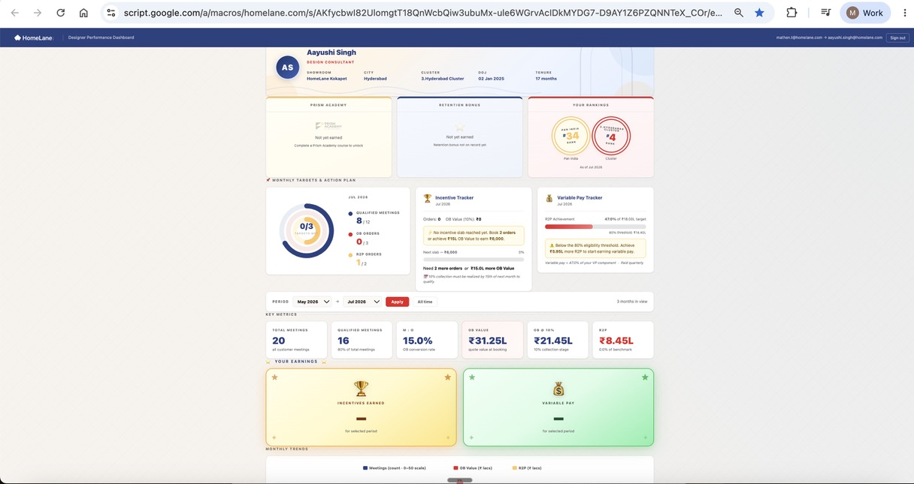

# Designer Performance Dashboard 📊

**A self-service performance mirror for individual designers — built on Google Apps Script**

Built for HomeLane's 750+ designer organisation, this tool gives each designer a personal, login-gated view of their own performance metrics, incentive earnings, and career progression benchmarks — without needing to ask a manager or wait for a monthly review.

---

## Screenshot



---

## The Problem It Solves

In a large, distributed design team, individual designers lacked visibility into:

- How their performance compares to benchmarks
- What incentives they have earned and why
- Where they stand in the career progression framework
- How their conversion metrics trend over time

This led to confusion around variable pay, low engagement with performance targets, and a high volume of queries to HR and operations teams — all of which could be resolved with self-serve data access.

---

## What It Does

The Designer Performance Dashboard gives each designer a personal, login-gated view of their own data — and gives managers a consolidated view across their showroom.

### Role-Based Access

| Role | What they see |
|---|---|
| **Designer** (DC, SDC, PDC, SPDC, DA) | Own rows only — full KPI detail |
| **DM / BM / GM / BUH** | All designers in their assigned showroom(s) — summary view |
| **Admin** | All rows across all showrooms — full data |

### KPI Cards (per designer)
- Qualified Meetings
- OB Value and OB Orders
- OB at 10% collection
- R2P Achievement
- Incentives Earned
- Variable Pay
- Career Pay
- Retention Bonus
- Pan-India Rank and Cluster Rank
- PRISM Academy graduation status

### Monthly Trends Chart
- Visual trend across months for key metrics
- Helps designers track trajectory, not just a single month's performance

### Knowledge Centre
- KPI definitions in plain language
- Incentive structure (how payouts are calculated)
- Career progression framework
- Variable pay formula demystified

---

## How It Works

```
Designer opens web app → Authenticated via Google account (homelane.com domain)
→ Role looked up in Access sheet → Data filtered to their scope
→ KPI cards, trends, and Knowledge Centre rendered
→ Every login logged to AuditLog tab
```

### Caching Architecture

The dashboard uses a chunked caching system to handle large datasets efficiently:

- All roles (including Admin) are cached for **15 minutes** per session
- Data is split into **90KB shards** to stay within Google Apps Script's 100KB CacheService limit
- Non-designer roles receive a **summary payload** (~60% smaller) on initial load, with full designer data fetched on demand when a manager drills into a specific designer

---

## Tech Stack

| Layer | Technology |
|---|---|
| App framework | Google Apps Script (HTML Service) |
| Data | Google Sheets (Sheet1 = data, Access = roles, AuditLog = login tracking) |
| Auth | Google account (homelane.com domain) — no password required |
| Caching | CacheService with chunked sharding (15-min TTL) |
| Deployment | Apps Script Web App |
| Access control | Role-based via Access sheet (Designer / DM / GM / BUH / Admin) |

---

## Google Sheet Structure

### Sheet1 (Data tab)
Expected column headers (row 1):

| Column | Description |
|---|---|
| `DESIGNER_EMAIL` | Designer's @homelane.com email (used for login match) |
| `DESIGNER_NAME` | Full name |
| `JOB_ROLE` | DC / SDC / PDC / SPDC / DA |
| `MONTH` | Month of data (date format) |
| `SHOWROOM` | Showroom name (used for manager-level scoping) |
| `CITY` | City |
| `CLUSTER` | Cluster name |
| `CUST_MEETINGS` | Total customer meetings |
| `QUALIFIED_MEETINGS` | Qualified meetings |
| `OB_ORDERS` | Orders booked |
| `OB_VALUE` | Order Book value (₹) |
| `OB_AT_10` | OB with 10% collection |
| `R2P` | R2P value |
| `DESIGNERS_DOJ` | Date of joining |
| `PAN_INDIA_RANK` | Pan-India rank |
| `CLUSTER_RANK` | Cluster rank |
| `PRISM_GRADUATE` | PRISM Academy graduate (Yes/No) |

### Access tab
Three columns: `EMAIL` | `ROLE` | `SHOWROOMS`

| Role value | Behaviour |
|---|---|
| `Designer` / `DC` / `SDC` / `PDC` / `SPDC` / `DA` | Sees only own rows |
| `DM` / `BM` / `GM` / `BUH` | Sees all designers in their SHOWROOMS (comma-separated) |
| `Admin` / `Administrator` | Sees all rows |

### AuditLog tab
Auto-created on first login. Logs: Timestamp, Email, Role, Scope, Status, SessionID.

---

## Setting Up

**Step 1 — Prepare the Google Sheet**
1. Create a Google Sheet with three tabs: `Sheet1`, `Access`, `AuditLog`
2. Populate `Sheet1` with designer performance data (column headers as above)
3. Populate `Access` with email, role, and showroom scope for each user

**Step 2 — Configure the script**
1. Open **Extensions → Apps Script**
2. Paste `Code.gs`
3. Update `SPREADSHEET_ID` in `CONFIG` with your Google Sheet ID
4. Create `Index.html` with the UI code

**Step 3 — Deploy as Web App**
1. Deploy → New Deployment → Web App
2. Execute as: **Me**
3. Access: **Anyone within homelane.com** (or Anyone with the link)

**Step 4 — Share**
Share the web app URL with designers and managers. They sign in with their HomeLane Google account and see only their own data.

**Step 5 — Clear cache after data updates**
Run `clearAllCache()` from the Apps Script editor whenever the underlying data sheet is refreshed.

---

## Business Value

- Reduces HR/ops queries about pay and performance — designers can see exactly how their payout is calculated
- Increases designer engagement with performance targets by making data self-accessible
- Managers get a consolidated showroom view without needing to export data
- Full audit trail of every login via AuditLog tab
- Scales to 750+ designers with no additional infrastructure — role-based filtering happens server-side
- Built for both HomeLane and DesignCafe — Access sheet controls who sees what

---

## About the Author

Built by [Mathen Thomas](https://www.linkedin.com/in/mathen-thomas-b0121018/) — AVP Business Operations & Program Office, leading AI-first design operations for 750+ designers across India.

> This repository contains a sanitised version of the production tool. The `SPREADSHEET_ID` has been removed and must be supplied before deploying. The `Index.html` UI file is not included in this public repository.
